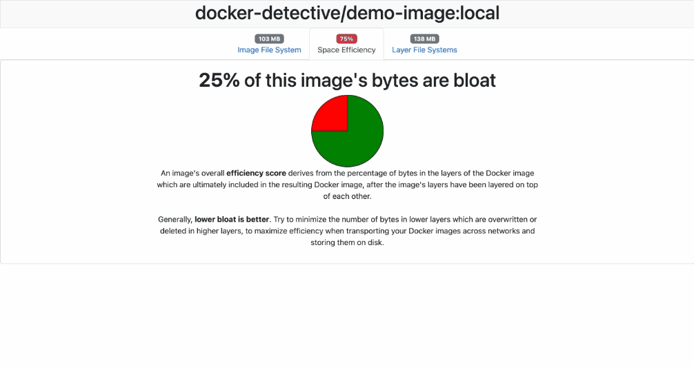

# docker-detective



`docker-detective` inspects a local Docker image's file system and internal image layers and serves up a web UI
which lets you explore the data. It is designed to highlight when the layers' total file system sizes are significantly
greater than the resulting image's file system size.

This typically indicates that your Docker image is inefficiently constructed, and contains files in its layers
which are being added and then removed later or which are being overwritten in subsequent layers. 

## How to use it

Just feed a docker image into the CLI:

```bash
$ docker-detective docker-detective/demo-image:local
Parsing Docker image...
Loading data from layer 3e0044020ba52c889bcdddea5ffea962117579017068f48160fb2451db438d59
Loading data from layer 4c65ffcd423741fc9e1c6e930c4809b97a0a36e8654a5346bcfa04c6785ce363
Loading data from layer a52c8f906147f312c6c64c5023d9ef6b09efefbaf29b4880dfae706a249b3ab7
Loading data from layer acee8cf20a197c920792d8ec2f4d19ecc8882779b7bc087b05cad7f21a55f950
Loading data from layer bac69bda6ad7c8b6aa7e3a5e7b7e80986a2733bf90d4b15bba90bb3c1357c5a5
Serving web app forever.
```

... and open the [app in a browser](http://localhost:1337).
